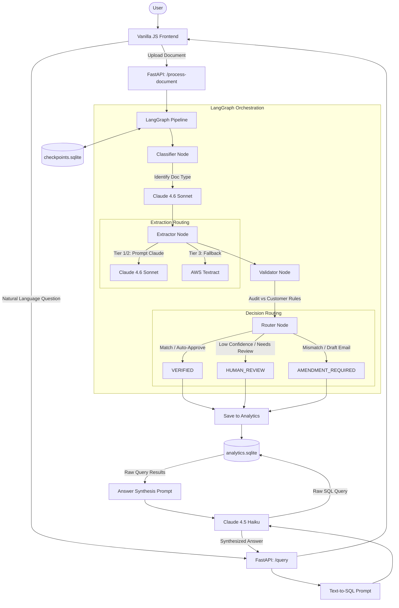

# Multi-Agent Trade Document Pipeline Architecture

This diagram illustrates the end-to-end data flow and component interaction within the Multi-Agent Trade Document Pipeline.

### Flow Breakdown:
1. **Document Processing**: A user uploads a document via the frontend. FastAPI receives it and kicks off the LangGraph pipeline. The document is classified and then extracted using Claude (or AWS Textract as a fallback). The data is validated against strict business rules, and a final decision is routed (Approve, Review, or Amend). The final state is stored in `analytics.sqlite`.
2. **Analytics Querying**: A user asks a natural language question. The backend prompts Claude 4.5 Haiku with the database schema to generate a SQL query. The query runs against `analytics.sqlite`, and the raw results are passed back to Claude to synthesize a final human-readable answer.
